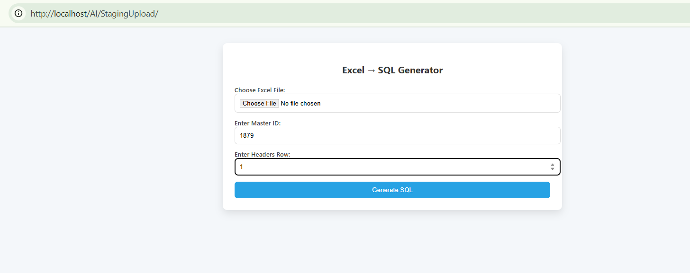
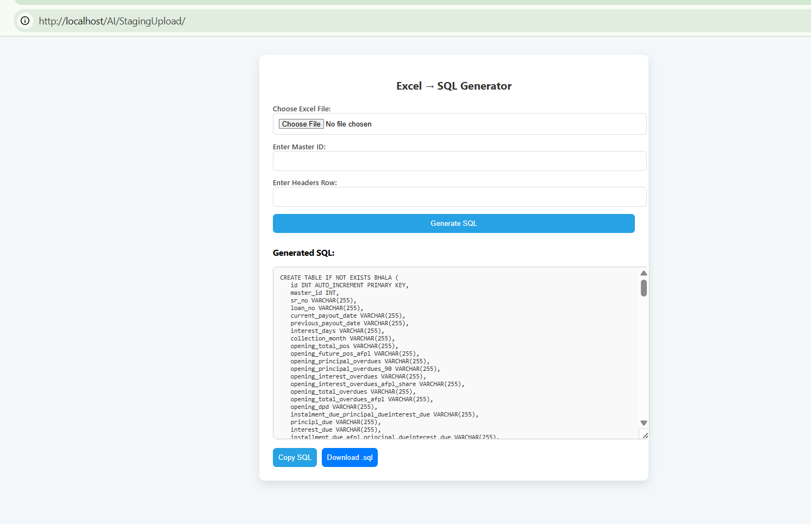

# StagingUpload_Final

This is a Python project for staging uploads. It includes scripts and resources for managing file uploads and processing.

## Structure
- `src/` — Source Python scripts
- `download.php`, `index.php` — PHP scripts for web interface
- `Required.txt` — Additional requirements or notes

## Setup
1. Install Python 3.8+
2. (Optional) Create a virtual environment:
   ```cmd
   python -m venv venv
   venv\Scripts\activate
   ```
3. Install dependencies:
   ```cmd
   pip install -r requirements.txt
   ```

## Usage
Run the main Python script:
```cmd
python src\stagingCreator.py
```
## UI View
The web interface is located at `index.php`. It allows you to upload files, view the staging area, and download the files.

Run the PHP script:
```cmd
php index.php
```

## Version Control
This project is ready for Git. All unnecessary files are excluded via `.gitignore`.

## Walkthrough Images
If you want to see how the project works, here are some walkthrough images:


Choose the excel file.
Add the master id which master you want to config.
Add headers row at you uploaded excel.



After Processing you will get output.


